# Setting Up Your Computer

HDA uses the following programming languages: Bash, R, Python, SQL, Git, and Latex/Markdown. It can be overwhelming to learn so many new things in such a short time. We will use the set up of your computer to introduce the languages, tools we use to interact with them, and some key computing concepts. Don't feel that you need to complete the entire set up in one session.

It is important to note the distinction between HDA using the languages and HDA teaching the languages. The fundamentals of each language will be introduced, but the focus will be on the application and utility of the languages rather than improving programming skills. Students are provided a free subscription to Datacamp which they are expected to use to hone their programming skills.

If you have trouble installing any of these programs please fill out this help form: https://forms.office.com/e/QnCqDH5kJ1

## Bash

Bash is a shell scripting language used to manage files, run scripts for automation, and generally control your system. There is no need to install Bash as every computer comes with a pre-built shell scripting language (like Bash).

Open the Terminal (remember it is called the Command Prompt on Windows) on your computer and type "pwd" and press enter. Then type "ls" and press enter.

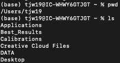
You have just told your computer to **p**rint the **w**orking **d**irectory (pwd) or tell you what folder you are currently in on your computer. We then told the computer to **l**i**s**t (ls) the contents of that folder. Interacting directly with the operating system can be difficult, clunky, and intimidating for beginners. To overcome this issue, companies like Microsoft developed **G**rapical **U**ser **I**nterfaces (GUI) to make interacting with the computer easier and more user friendly. Now you are able to double click icons on your desktop instead of needing to type into the terminal -- vastly expanding the number of people who can use computers.

That is all you need to know about Bash for now as it will be covered in more detail in the course. The key takeaway is that a programming language allows you to interact with a program -- here your operating system. There are different programming languages for different programs. GUIs make it easier and more user friendly to interact with key programs.

## R

R is a domain-specific, statistical programming language. This means that it has been designed to allows users to perform mathematical and statistical analysis without needing advanced programming knowledge. 

[Install R](#installing-R) and then come back here. (The link will take you to the "Installing R and R Studio" Chapter of this guide).

Open the Terminal. Type "R" and press enter. Your terminal should now be displaying R. Now type in "2+2" and press enter. You should get the answer of "4". Type "print('Hello World')" and press enter. Now type "pwd" and press enter. You get an "Error: object "pwd" not found". Type in "quit()" and press enter then "n" and enter when prompted. 

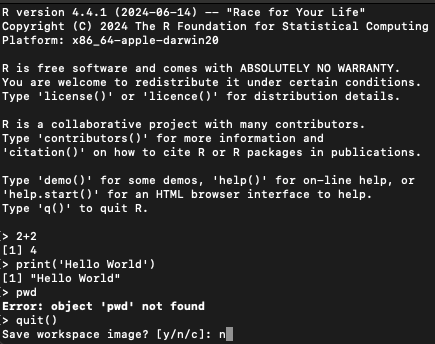


You are now back in the Terminal. Type "2+2" and press enter. You get an error that the "command is not found". Now type "print('Hello World')". You can an error that there is "unknown file attribute: H". Now type "pwd" and press enter.


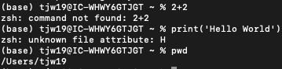

What has just happened? You have just written in two separate programming languages. Key commands in one languages are not recognized in another language. Bash is for interacting with operating systems so will have a lot of inbuilt commands to do so (like printing the user location). R is for statistical analysis so can handle numeric values and has inbuilt programming functions to make use easier (like print).

Like using Bash, this can be a bit clunky, difficult, and intimidating. All popular programming languages have at least one GUI to solve this issue. The most popular GUI for R is called R Studio.

### Using a GUI

[Install R Studio](#installing-Rstudio) and then come back here. (The link will take you to the "Installing R and R Studio" Chapter of this guide).


Open R Studio. Type in "2+2" and press enter, then "print('Hello World')" and press enter. You are typing in the console, which was the exact same thing that you accessed from the Terminal by typing in "R".

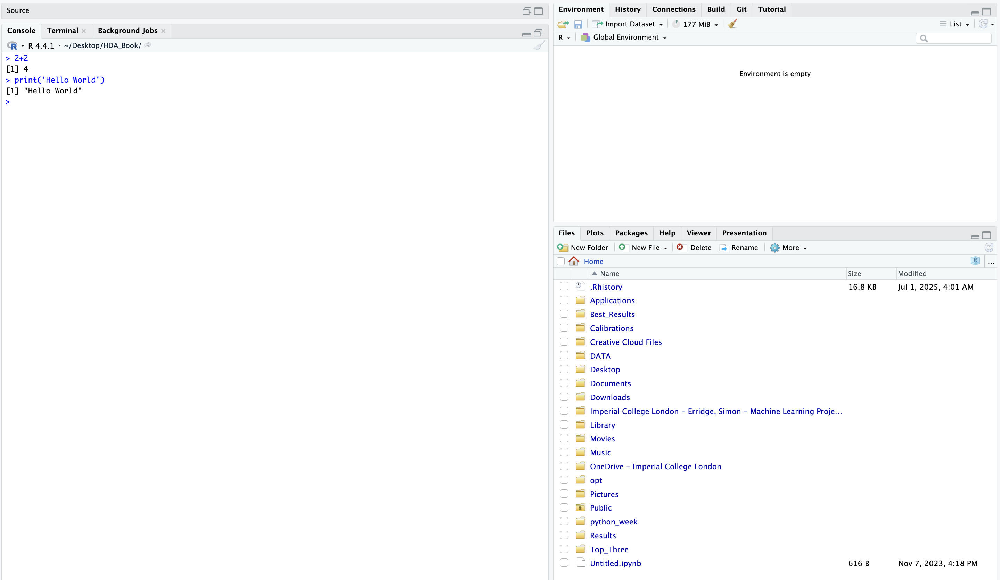

Let's see how this can be helpful. Create a new R Script by click on the option in the upper left of the program.

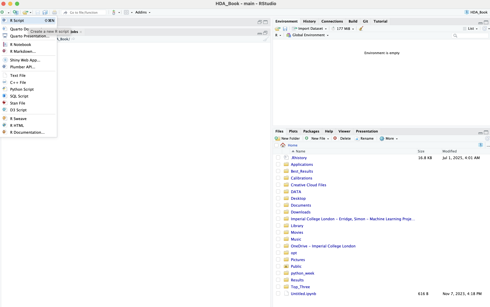

In the new script, type in "2+2" press enter then type "print('Hello World')" and press enter. What has happened? Nothing since the script acts like a text document. Highlight both lines of code and then click "Run" in the upper right of the script window. Now you will get the output you expected.

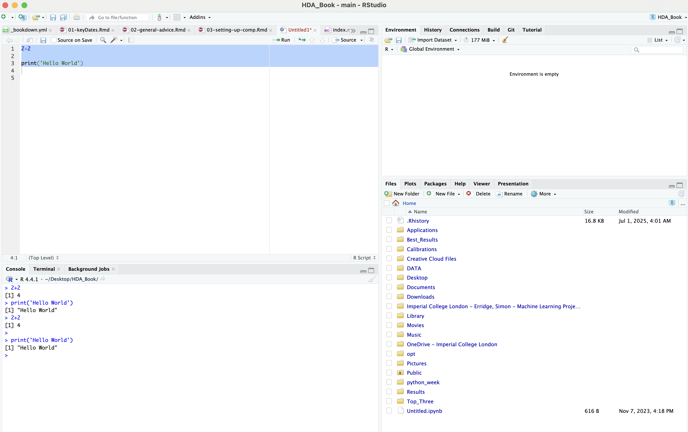

If you wanted you could change part of the script easily and run it again. Or save it and send it to a friend. This is all that you need to know about the functionality of R Studio for now but it has many powerful features. For example: This book was written in R Studio (you can see the files open in the script pane in the picture above).


## Python

Python is an interpreted, object-oriented, high-level programming language with dynamic semantics. Its high-level built in data structures, combined with dynamic typing and dynamic binding, make it very attractive for Rapid Application Development, as well as for use as a scripting or glue language to connect existing components together. Python's simple, easy to learn syntax emphasizes readability and therefore reduces the cost of program maintenance.

[Install Python](#installing-python) and then come back here. (The link will take you to the "Installing Python, Anaconda, and VSCode" Chapter of this guide).


Open your Terminal, type in "python" and press enter. Type in "2+2" and press enter, type in "print('Hello World')" and press enter, type in "pwd" and press enter. Close your terminal window.

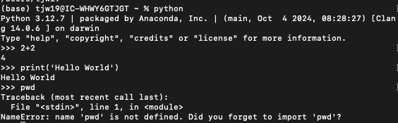

What just happened? Same commands worked as in R, but the commands from bash did not work. Python and R have a lot of overlap. Generally, Python is less user friendly (but still accessible) but far more powerful and flexible. Most neural networks are written in Python. R is more user friendly, less powerful, but has more detailed and useful prebuilt statistical functions. It is important to know both in order to be able to use the right tool for the right job.

### Python IDEs

There are more Python GUIs than there are R GUIs - but a lot of them are actually IDEs. An **I**ntegrated **D**evelopment **E**nvironment is a software application that provides a comprehensive environment for software development, often including a GUI. A GUI, on the other hand, is a type of user interface that allows users to interact with applications using visual elements like windows, icons, and menus, rather than through text commands. IDEs are places to write code that offer some supportive features. Almost all IDEs provide syntax highlighting, debugging, and code completion.

R Studio is technically an IDE, but is commonly referred to as a GUI. This is because users do not use R to write software. Python is primarily used to develop software, so the associated programs are referred to as IDEs. The most common Python IDEs are Jupyter Notebook, Pycharm, and VSCode.

[Install Python IDEs](#installing-python-ides) and then come back here. (The link will take you to the "Installing Python, Anaconda, and VSCode" Chapter of this guide).

### Juypter Notebook Exercise

Open Anaconda and then Juypter Notebook. When the program opens, click on "New" and then the "Python 3 (ipykernel)" option:


```{r, echo=FALSE, fig.cap="Opening Juypter Notebook", out.width = '100%'}

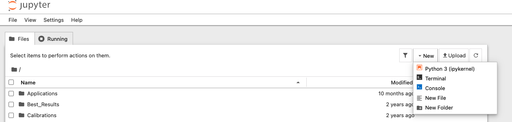
```

The Program should look like this:

```{r, echo=FALSE, fig.cap="What a Juypter Notebook Looks like", out.width = '100%'}

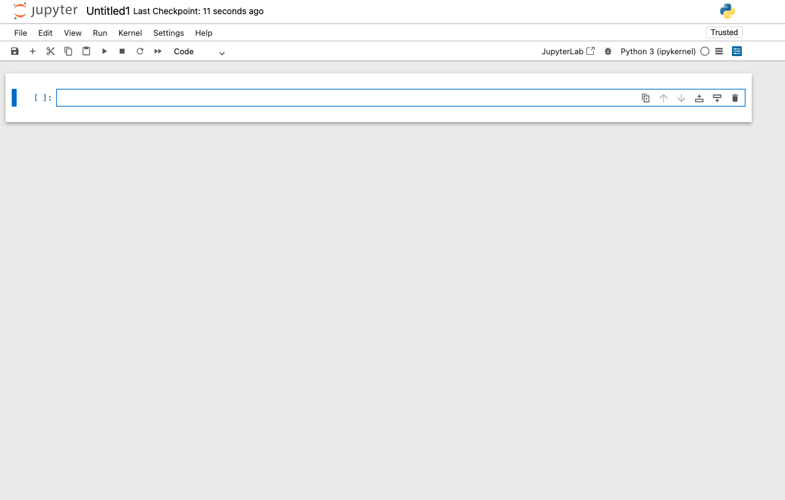
```

The "box" you can see is called a code cell. Create another code cell below the current one by pressing the button on the right hand side of the code cell that corresponds to adding a cell below:

```{r, echo=FALSE, fig.cap="Adding More Code Cells", out.width = '100%'}

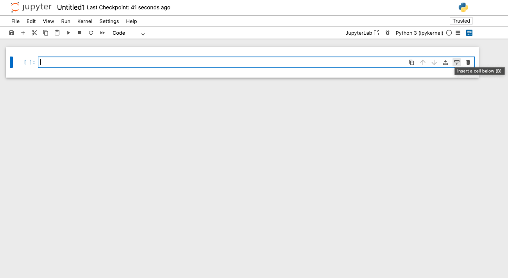
```

Type the same two lines in each of the boxes: "#adding some numbers" and "print(2+2)" (without the quotation marks). Click on the second box and change the option from Code to Markdown in the ribbon at the top of the document:


```{r, echo=FALSE, fig.cap="What to Input", out.width = '100%'}

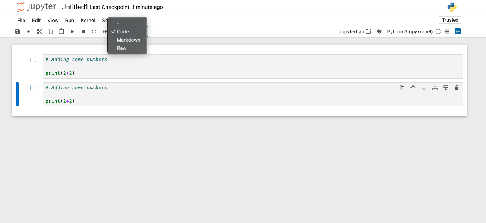
```


Run both of the code cells:

```{r, echo=FALSE, fig.cap="How to Run the Entire Script", out.width = '100%'}

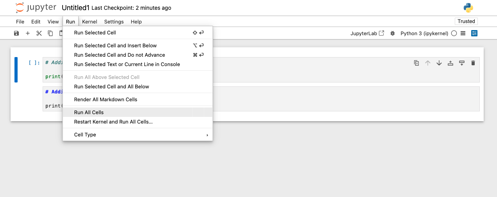
```


What happened? Does yours look like this?

```{r, echo=FALSE, fig.cap="Juypter Output", out.width = '100%'}

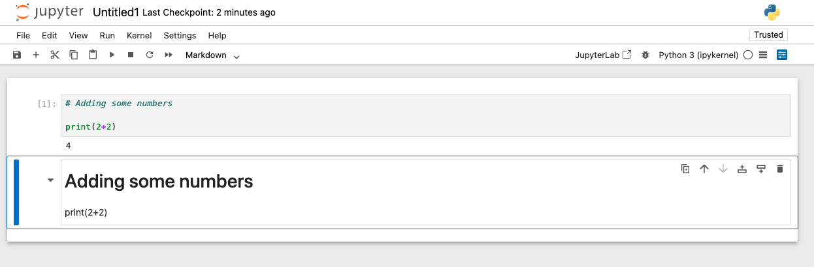
```

Juypter notebook allows you to write Python code or "markdown". Markdown is another programming language - but don't worry, you don't have to learn it in any detail! It just allows you to type text that is nicely formatted or code that can display the output. This allows for nicely formatted reports and documents. For example: each chapter in this book is written in R Markdown (which uses markdown as well).

## SQL

Structured query language (SQL) is a domain-specific, standardized programming language for storing and processing information in a relational database. It is the best language for collecting, manipulating, and querying large amounts of data. Most search engines (Google), plotting tools (Power BI), and platforms (Salesforce) turn your commands in their user interface (a GUI) into a SQL query that it gives to its database.

There are multiple different dialects of SQL, much like there are multiple different dialects of shell scripting languages. The different dialects of SQL (MySQL, SQLite, SQL Server, Oracle, etc.) all have the same syntax for most of their commands. Different dialects have different uses or additional capabilites for specific use cases. Learning in one SQL dialect will allow you to quickly pick up most of the other ones. HDA teaches MySQL.

[Install MySQL](#installing-sql) and then come back here. (The link will take you to the "Installing MySQL and DBeaver" Chapter of this guide).

### DBeaver

DBeaver is free and open source universal database tool for developers and database administrators. It is a SQL client software application and a database administration tool. It works with any version of SQL and with any database - whether on your computer or on the internet.

```{r, echo=FALSE, fig.cap="Downloading R from the CRAN", out.width = '100%'}

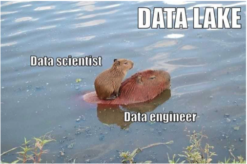
```

[Install DBeaver](#installing-dbeaver) and then come back here. 


## Git

Git is a distributed version control system that tracks versions of files. It is often used to control source code by programmers who are developing software collaboratively. Git. A command-line session showing repository creation, addition of a file, and remote synchronization.

GitHub is a cloud-based platform where you can store, share, and work together with others to write code. Storing your code in a "repository" on GitHub allows you to: Showcase or share your work. Track and manage changes to your code over time. Let others review your code, and make suggestions to improve it.

GitHub is widely considered an industry standard for software development and version control. It's the dominant platform for hosting and collaborating on code, used by millions of developers and organizations globally. Over 90% of Fortune 100 companies use GitHub. 


[Install Git](#installing-git) and then [Make a Github Account](#installing-github)

You will be introduced to Git and Github in week 5 of the Program, so you do not need to be a master now.

## Other Programming Languages

A Turing-complete language (also called a universal language) is one where you can compute anything that any other computational method can compute. In other words, a language that's non-universal—or Turing incomplete—has some limits on the set of things that it can compute

Many programming languages are Turing complete, meaning they can perform any computation that a Turing machine can. However, some languages are specifically designed to be non-Turing complete, often for reasons of safety, predictability, or domain-specificity. Examples of non-Turing complete languages include: regular expressions (in their standard mathematical definition), HTML, CSS, and some versions of SQL

So why are there so many programming languages? They are each optimized to make different popular tasks easier. While the syntax varies drastically between languages, the core fundamentals are the same. Learning the most popular and user friendly languages (R, Python, and SQL) is a great way to start your programming journey and may be all that you end up needing. It should be noted that this course does not teach or require computer science skills, front-end development, or back-end integration.


