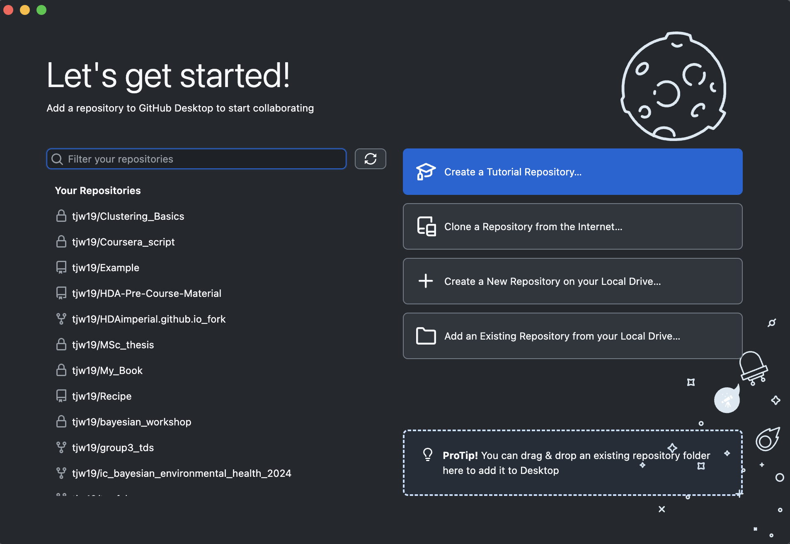

# Installing Git, Github, and Github Desktop

Collaboration is at the heart of programming and research. Git allows a group of programmers or researchers to work together on a project in an organized and systematic manner. You may have worked on a group project where the files being shared have increasingly ridiculous names -- project_v3, project_v3_final, project_v3_final_final, etc. You may have also updated a version of a project, only to find out that you had been working on an older version. Git and Github solves all of these problems, and more.

## Git {#installing-git}

Git is a version control system that lets you track who made changes to what when and has options for easily updating a shared or public version of your code on github.com. Version control is a system that tracks and manages changes to files over time, primarily used in software development to manage changes to source code. It allows teams to collaborate, track modifications, compare different versions, and revert to previous states, ensuring a history of changes and minimizing potential disruptions. For example, if you change your project code and break everything, you are able to instantly change your code back to earlier versions (that still worked).

It is the most widely used language in programming with every project that is being written in every language using Git (with minor exceptions). Note: There are other version control systems such as Mercurial and Fossil but they are niche applications with far less utility than Git.

The latest version is 2.50.1. You may already have Git on your computer (it is included in the install of various other programs).

To check, please open the Terminal app, type git --version and press Enter/Return. If you do not have Git, you will be provided instructions to follow. Alternatively, you may close the Terminal and go to the git website to download an installer: 

**[Install Git](https://git-scm.com/downloads)**

Please select the installer download for your system and computer specifications. If you are unsure which installer to select, please see the [Computer Specifications](#Computer-Specifications) section of this guide.

### Note for Mac Users

If following the instructions provided by Git in your Terminal, follow the instructions to Install the "command line developer tools". Do not click "Get Xcode", because that will take too long and is not necessary for our Git needs. If you require at a later date, it will be easy to install then. After installing these tools, there won't be anything in your /Applications folder, as they and Git are command line programs. 

For older versions of OS X (10.5-10.8) use the most recent available installer labelled "snow-leopard" (look for the file name with snow-leopard in it): **[Install Git for OS X 10.5-10.8](https://sourceforge.net/projects/git-osx-installer/files/)**

Note: this project is no longer maintained. Because this installer is not signed by the developer, you may have to right click (control click) on the .pkg file, click Open, and click Open in the pop-up dialog.

### Updating Git

If you have git, but an older version that 2.50.1, then you can update your git version - using git. Type to the following into your Terminal and press Enter:

git clone https://github.com/git/git


## Github {#installing-github}

You will need a Github account for this program and for your next steps. Employers often ask to see your github as part of your application process. Every company writing software of any type uses Github. Like everything else in this guide, you don't need to be an expert with Github now - but the more you use these unfamiliar tools the easier it becomes.

You will need an account at github.com for parts of the Git lesson. Basic GitHub accounts are free (you don't need more than a basic account).

**[Create a Github Account](https://github.com/)**

There is nothing else you need to do with the account for now, but please make sure that the password is saved to make it easy to access in the future.


## Github Desktop

Github Desktop is one of the many GUIs for Github. Like other GUIs, it allows you to interact with Git and Github without using the command line and has useful visualizations to make what you are doing much easier. 

"GitHub Desktop is really one of the best 80/20 programs I have seen. It hides the details of git (which are irrelevant) and just lets you get on with your work" - from the promotional material of Github Desktop.

**[Install Github Desktop](https://desktop.github.com/download/)**

When you open Github Desktop, it should look like this:

```{r, echo=FALSE, fig.cap="Opening Github Desktop", out.width = '100%'}


```

Click sign in to Github.com and follow the instructions. Once you are finished, your Github Desktop should now look like:

```{r, echo=FALSE, fig.cap="Github Desktop ", out.width = '100%'}


```

That is all for now. If you want to start becoming familiar with Github, click on the "Create a Tutorial Repository" in Github Desktop to be walked through the basics.

Did you notice the word "repository" cropping up again? You had previously been told that CRAN was a repository for R were you could download approved R packages. You are now making your own repositories. While they are not official (like CRAN), other users can download your code and use it if you do not set your repository to private (which is not a bad thing!). 


