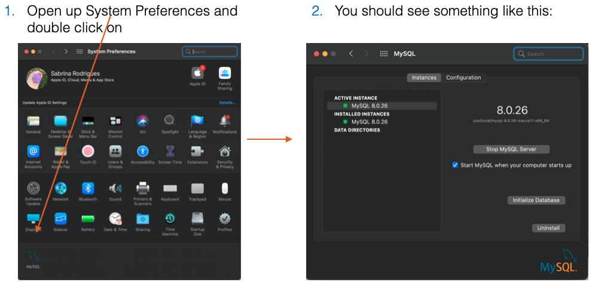
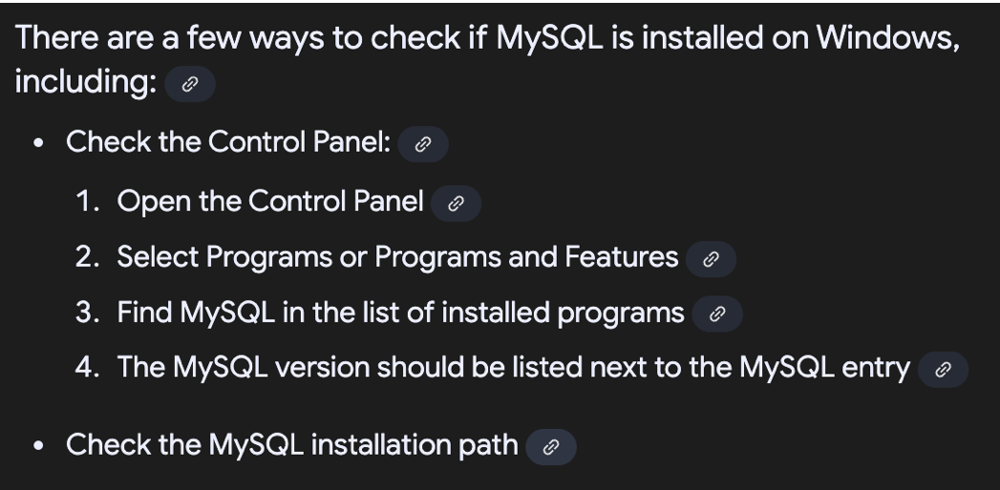
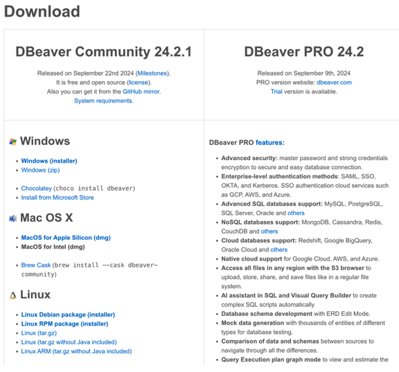
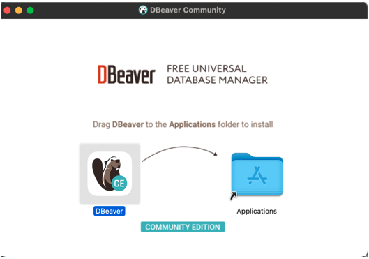
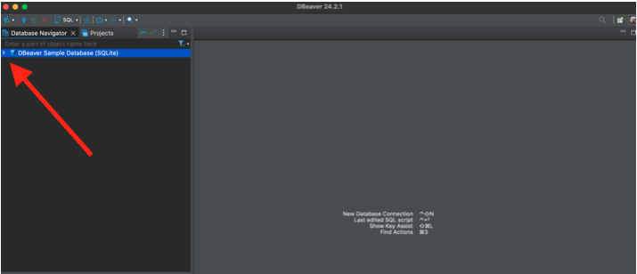
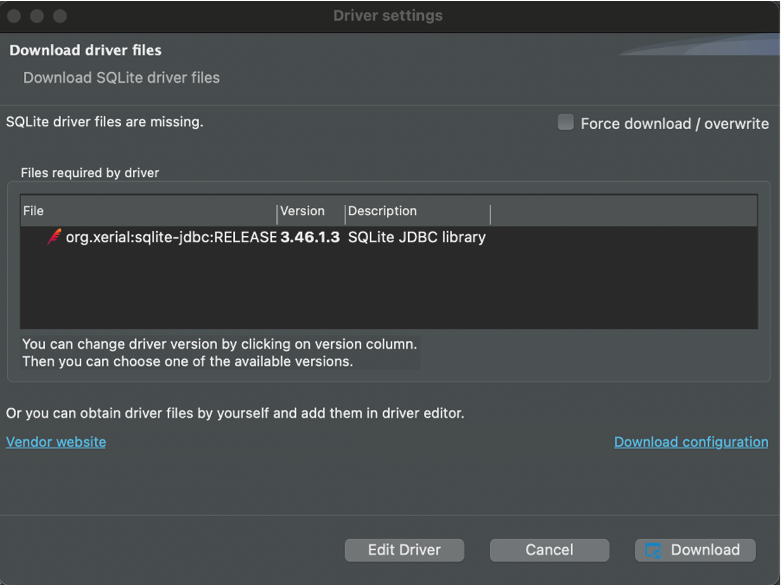
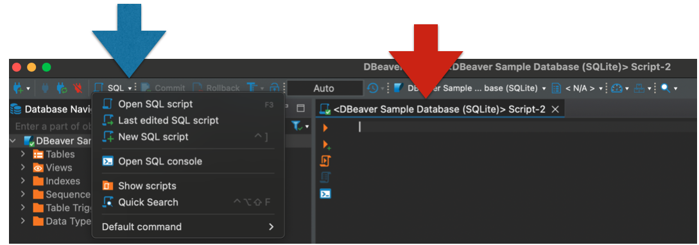
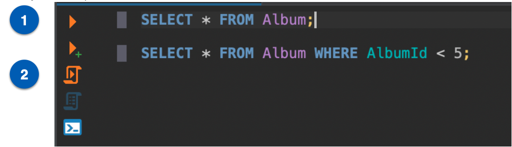

# Installing MySQL and DBeaver

You will be asked to create a password for mySQL. You will need it every time you want to use mySQL. Please write it down somewhere and do not lose it! Note: This is terrible information security practice. However, you mySQL password for an instructional course is not something that you need to protect. We ask the students to do this each year, but a portion of them always forget.

SQL (Structured Query Language) is a standard language used to store, retrieve, and manipulate data in relational databases. It allows end-users to communicate with databases and perform tasks like creating, updating, and deleting databases. It underpins most modern technonology. While there are a host of careers that revolve entirely around SQL, any analyst is expected to know enough to be able to retrieve the information that they need. While some organizations use Excel for their data management, this is not scalable and leads to unforeseen errors.

[Excel Loses 16,000 Covid Cases](https://www.bbc.co.uk/news/technology-54423988)


## MySQL Installation {#installing-sql}

The latest stable release is MySQL 8.0.36. While there are newer versions available, they still contain bugs that have yet be to patched (or found in some cases).

Follow the instructions depending on the type of operating system you are running.

Note: To re-emphasize, you will be asked to create a password along the process. Please write it down somewhere!

### Mac users

If you are using a Mac OS of version < 10.14 and MySQL 8.0 does not work, you can install an older version of MySQL by going to this [Archive](https://downloads.mysql.com/archives/community/) and download MySQL 5.7.x that suits your Mac OS version. 

[Follow These Instruction Up to Step 8](https://dev.mysql.com/doc/refman/8.0/en/macos-installation-pkg.html)

Once your installation is done you can test if it was successful by doing the following:


```{r, echo=FALSE, fig.cap="Mac MySQL Check", out.width = '100%'}


```


### Windows users 

If you are using a Windows of version < 10, you can install an older version of MySQL by going to this [Archive](https://downloads.mysql.com/archives/installer/) and download MySQL 5.7.x that suits your Windows version. 

For those with Windows 10 or higher, please install MySQL 8.0:

[Windows Install](http://www.mysqltutorial.org/install-mysql/)


Once your installation is done you can test if it was successful by doing the following:

```{r, echo=FALSE, fig.cap="Windows MySQL Check", out.width = '100%'}


```


## DBeaver Installation {#installing-dbeaver}

DBeaver is a free, universal database tool and SQL client. It's designed for developers, database administrators, and analysts who work with various databases, including both SQL and NoSQL types. DBeaver offers a user-friendly interface for managing, developing, and analyzing databases, with features like code completion, syntax highlighting, and a plugin architecture for customization. There are paid options, but you do not need to purchase anything.

There are other SQL GUIs or IDEs, but there is no consensus industry favourite. Unlike the other programming languages you have seen so far, SQL has closed-source versions (not free). Both Microsoft and Oracle have their own version of SQL (which is very similar to MySQL) which their applications run on. Unlike R or Python, if you are working on a commercial product that has a license from either of those companies, you can call up their support center to get help with your issues or contract out large scale development tasks to their companies.

Please download the installer for DBeaver Community 24.1.4 that matches your operating system:

[DBeaver Install](https://dbeaver.io/download/)


```{r, echo=FALSE, fig.cap="DBeaver Free vs Paid", out.width = '100%'}


```

Mac Users will need to drag the downloaded program into the Applications folder:

```{r, echo=FALSE, fig.cap="Downloading R from the CRAN", out.width = '100%'}


```


### Testing out DBeaver

This exercise will be covered in the first week of the Program (along with other material). Don't worry if you can't complete it or if something doesn't work. You will have a live session with support to troubleshoot any problems.


When you open DBeaver for the first time, you will be asked if you want to create a sample database. Say yes.

If you said no accidentally, follow the instructions at this link to create the sample database
https://dbeaver.com/docs/dbeaver/Sample-Database/


Your screen should look like this:

```{r, echo=FALSE, fig.cap="What DBeaver Looks Like", out.width = '100%'}


```

Now, click the ‘>’ next to "DBeaver Sample Database (SQLite) (where the red arrow is pointing in the picture above).


You will be asked to Download the SQLite driver file:


```{r, echo=FALSE, fig.cap="Downloading SQLite Driver File", out.width = '100%'}


```


Before you start testing DBeaver using a local SQLite server. Let's go over some definitions:

Local = On your computer\
Server = Hardware where data is stored (can be local, remote, cloud, etc.)\
SQLite is the dialect of SQL that the database is set up to be queried in.

In DBeaver, create a New SQL script and save it with an informative name:

```{r, echo=FALSE, fig.cap="DBeaver New Script", out.width = '100%'}


```

What does the writing above your script (the red arrow above) mean?

Write the two commands in the picture below into your script.\
After writing each line (with your cursor at the end of the line), press the orange arrow (1 in the picture).\
What happened?\
When your have entered both press the orange arrow inside the scroll (2 in the picture).\
What happened?\
Switch the order of your lines of code and press (2) again. Is your output any different?\
Save your script\


```{r, echo=FALSE, fig.cap="Running SQL Commands", out.width = '100%'}


```

You have just queried an instance of a local server using a SQLite relational database management system in an Integrated Development Environment. Don't get overwhelmed by any confusing or complexing sounding jargon though -- when you start at the beginning and keep practicing you will be writing complex code before you know it.

A last note: HDA teaches MySQL, but you just used SQLite. Does this mean that the commands you ran won't work in MySQL? No. Remember that most dialects of SQL have a vast overlap. These commands will work in SQLite, MySQL, SQL Server, and more. You don't need to worry about the other dialects for now, but remember that being an expert in one version of SQL will make it trivial to become an expert in another.


