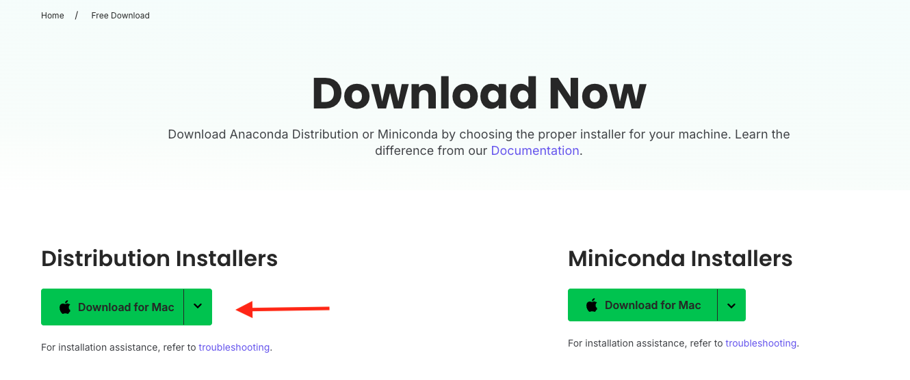
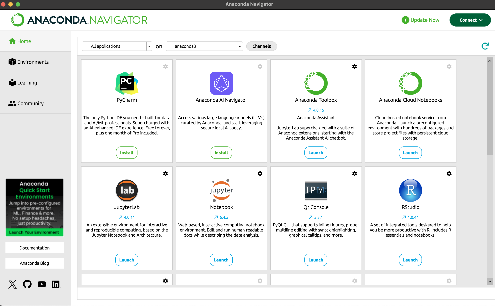
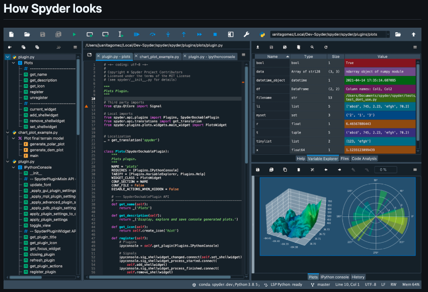
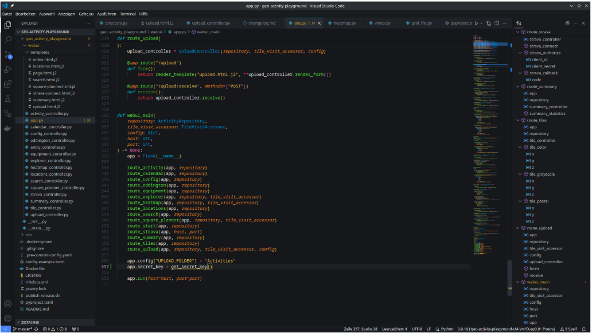
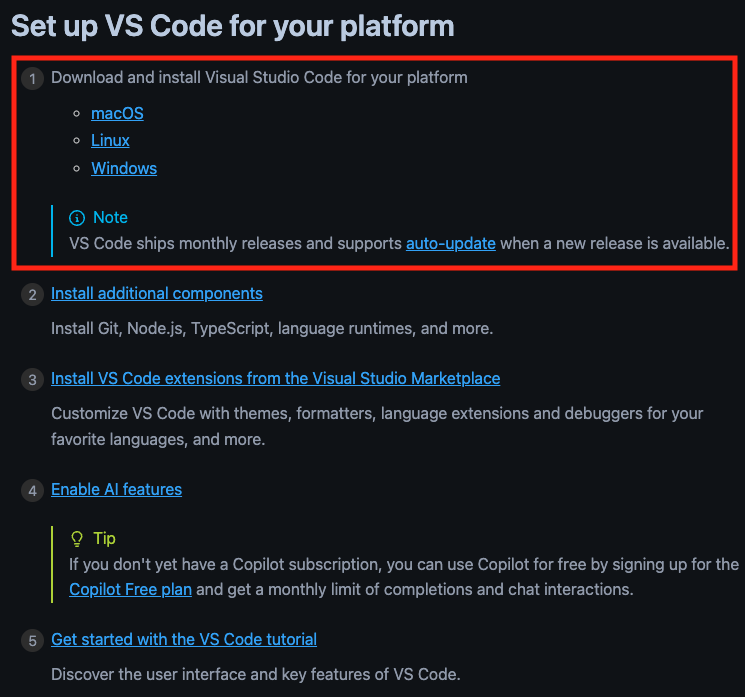
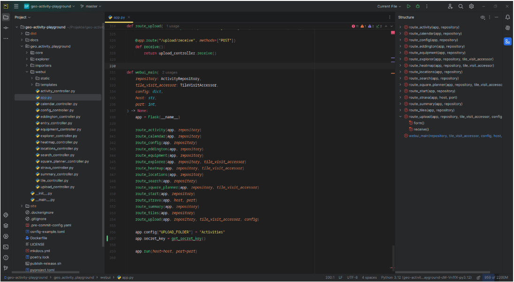

# Installing Python, Anaconda, and VSCode

Python is a popular language for research computing, and great for general-purpose programming as well. It requires installing packages for most analytical tasks. While it is possible to use an all-in-one installer to download Python and a large portion of the packages that most researchers need, HDA will have you install the packages as you go to gain experience with programmatically downloading packages.

Users employ a wide range of IDEs to work in Python. The three most common are Jupyter Notebooks, Pycharm, and VSCode. Anaconda is a Python distribution which has created a popular package and environment manager called conda. In simple terms, if you download Anaconda, you get a bundle of popular programs and IDEs that you can use to work in Python. Conda is essentially Python's equivalent of CRAN for R -- where you can access packages and code written by other users.

Note: This is an over simplification of what conda is. It allows users to build environments, download packages containing any code, and can handle complex dependencies. You will be introduced to these concepts further in the course and how to use conda. There is another "repository" for Python called pip that only installs python packages that is more equivalent to CRAN. There are also conventional repositories such as PyPI.

For now you just need to know that you need to install Python, Anaconda, and the VS Code.

## Python {#installing-python}

The latest stable version of Python is 3.13.3. Please download the "installer" which is suitable for your computer specifications. If you are unsure what option to select, please see the [Computer Specifications](#Computer-Specifications) section of this guide.


**[Python for Mac](https://www.python.org/downloads/macos/)**

**[Python for Windows](https://www.python.org/downloads/windows/)**


## Python IDEs {#installing-python-ides}

There is no best IDE. HDA will primarily use Juypter Notebooks and VS Code to familiarize you with industry standard tools. Additionally, being comfortable into VS Code will make interacting with advanced computing environments that don't have as user friendly of GUIs easier - such as Imperial's High Performance Computing Server. You may choose a preferred option for any independent work (not for practical sessions) and may be forced to use a different IDE at your next step.

Why is there not one best IDE? Each one is designed with a different purpose in mind. Some are meant to use sharing. Others to appeal to scientist. There are also a large number that focus solely on software development. As always, you must pick the right tool for the right job.

### Anaconda

Please download the "installer" which is suitable for your computer specifications. If you are unsure what option to select, please see the [Computer Specifications](#Computer-Specifications) section of this guide.

**[Download Anaconda](https://www.anaconda.com/download?utm_source=anacondadocs&utm_medium=documentation&utm_campaign=download&utm_content=installwindows)**

You do not need to sign up for an account even if prompted.

After clicking on the link above, you will need to select the "Skip registration" option on the resulting website (the red circle in the picture below):

```{r, echo=FALSE, fig.cap="First Page of Anaconda Website", out.width = '100%'}


```

Please select the "Distribution Installers" option (red arrow in the picture below):

```{r, echo=FALSE, fig.cap="Select Distribution Installers", out.width = '100%'}


```

Note: The difference between the Distribution and Miniconda Installers is what is included in the download package. The distribution installation comes with a variety of useful packages and programs that you can easily install. If you install the Miniconda then you will have to manually install all of the following IDEs (which is not recommended). 

### Juypter Notebook, Juypter Lab, Pycharm, and Spyder

Once Anaconda has been installed, please open the application (this can take a little while). Once it is open, it should look like this:

```{r, echo=FALSE, fig.cap="Anaconda Program Manager", out.width = '100%'}


```

Note that there are two options: "Install" for programs you do not have and "Launch" for those that are already installed. Please click "Install" for PyCharm, JupyterLab, Jupyter Notebook, and Spyder (you may need to scroll down to find them all). We will not use the other options in HDA as they are not useful or commonly used.

The Jupyter Notebook is the original web application for creating and sharing computational documents. It is commonly used for informal reports due to its ability to handle text and code in a neatly formatted manner. Jupyter Lab adds a file structure ribbon to the Juypter Notebook layout to easily browse your computer for files to open. They are essentially equivalent and using one over the other is down to personal choice.

Spyder is very similar to R Studio with a panel lay out with a plotting window and console to visualize the output of code:

```{r, echo=FALSE, fig.cap="What Spyder Looks Like", out.width = '100%'}


```

Pycharm is a big deviation from the GUIs that you have seen so far. It is designed for software development so does not have a built-in window to visualize the results of the code (such as the plots). This can be disorientating for a scientist looking to write analytical code. However, the large suite of additional functions make Pycharm a powerful development environment for complex coding projects.

```{r, echo=FALSE, fig.cap="What Pycharm Looks Like", out.width = '100%'}


```


### VS Code

Visual Studio Code, commonly referred to as VS Code, is an integrated development environment developed by Microsoft for Windows, Linux, macOS and web browsers. Features include support for debugging, syntax highlighting, intelligent code completion, snippets, code refactoring, and embedded version control with Git.

"Visual Studio Code remains the preferred IDE across all developers, increasing its use among all developers this year from 75 percent to 81 percent." 
- the Stack Overflow 2023 Developer Survey

**[Download VS Code](https://code.visualstudio.com/docs/setup/setup-overview)**

**Please only do the first step of the instructions (red rectangle in the picture below*)**. You will go over the other options during the course when necessary. We do not recommend attempting to modify the base install for now as it can be very overwhelming and easy to install things incorrectly.

```{r, echo=FALSE, fig.cap="Install VS Code", out.width = '100%'}


```

What does VS Code look like?

```{r, echo=FALSE, fig.cap="What VS Code Looks Like", out.width = '100%'}


```

It looks like Pycharm! Both are development focused IDEs that do not have a graphical display for plots. So why is VS Code so much more widely used than Pycharm?


### Pycharm vs. VS Code

Pycharm is better for pure Python development as it has more features, refactorings, powerful fuzzy search and slightly more helpful code completion and tooltips.

VS Code is better for projects with multiple programming languages and it has less advanced but more broad support. With VS Code you can switch between Python, Python Notebooks, R and Bash with ease.


## Package Installation

Users should install Python packages in a programmatic manner which will be taught during the course term. Students will be guided through package installations needed for each practical session.


