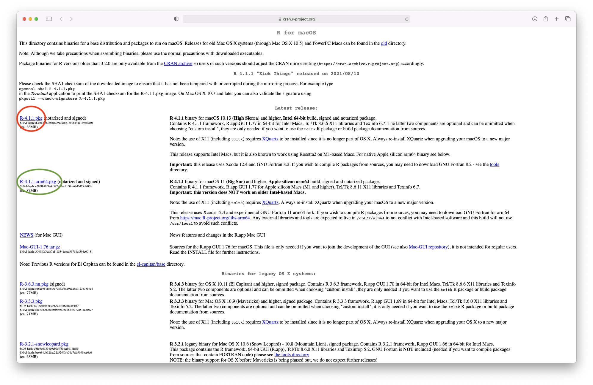
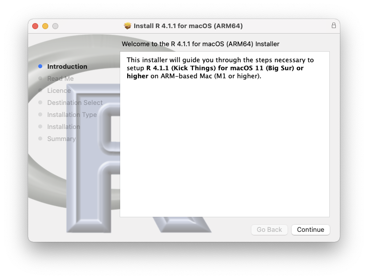
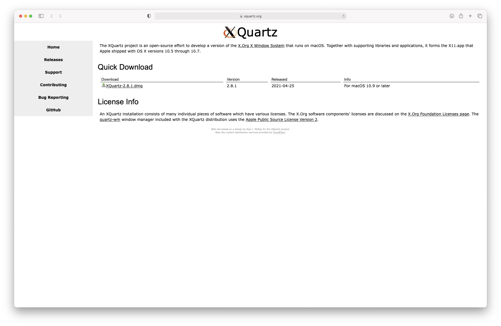
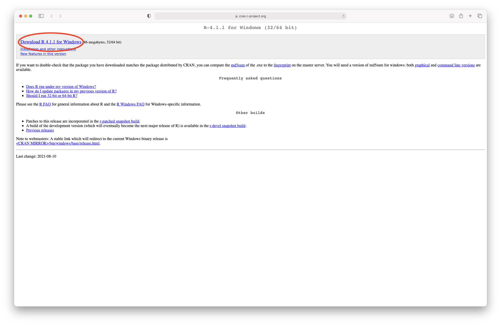
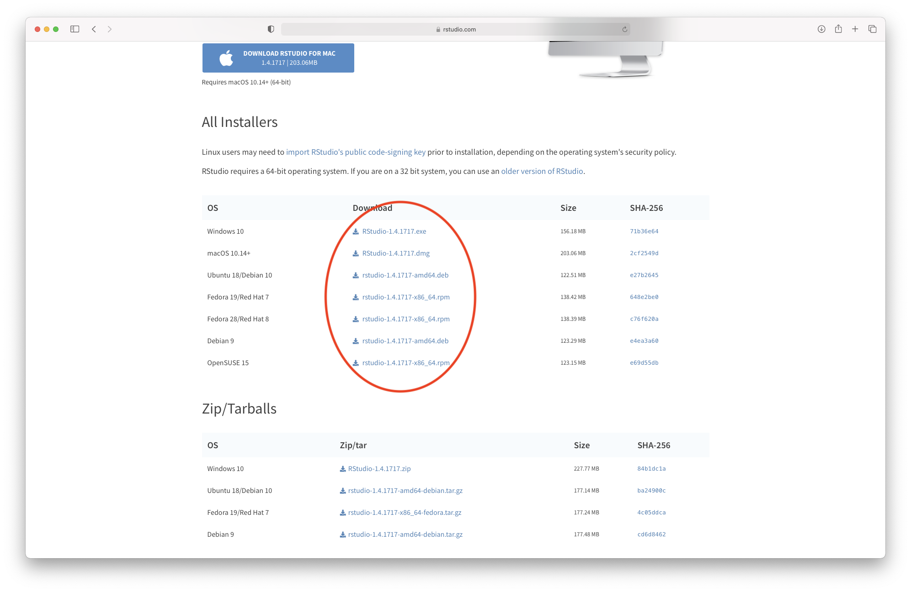

# Installing R and R Studio 

You must install R before you can install R Studio. A note: R is an open-source project that can be downloaded from the CRAN Repository. R Studio is owned by Posit PBC (a public benefit corporation). It puts out a free version of R Studio and a paid enterprise version. You should not pay for R Studio. You will need to go to two different websites to download R and R Studio.


## Installing R {#installing-R}

Please download and install R (version 4.5.1) from the CRAN following the relevant instructions below.

### Mac users

R for Mac OS X can be downloaded from the following link: https://cran.r-project.org/bin/macosx/

The link will take you to the download page on the CRAN (Figure 1). Please select the latest version by clicking on R-4.5.1.pkg (circled in red) if this version can be supported on your machine. Otherwise, choose the latest supported version. If you have a laptop with the Apple chip, you can select the version circled in green, which has been specifically designed for that chip.

```{r, echo=FALSE, fig.cap="Downloading R from the CRAN", out.width = '100%'}


```

Once the download has finished, you can follow the recommended steps for installation (Figure 2). 

```{r, echo=FALSE, fig.cap="R installation", out.width = '100%'}

```

As indicated on the download page, you will also need to install XQuartz to be able to use some more advanced R functionalities. This can be done from this link: https://www.xquartz.org

```{r, echo=FALSE, fig.cap="Downloading XQuartz", out.width = '100%'}

```


### Windows users 

R for Windows can be downloaded from the following link: https://cran.r-project.org/bin/windows/base/

The link will take you to the download page on the CRAN (Figure 4). Please select the latest version by clicking on "Download R 4.5.1 for Windows".

```{r, echo=FALSE, fig.cap="Downloading R from the CRAN", out.width = '100%'}

```


## Installing RStudio {#installing-Rstudio}

R Studio is both a GUI and an integrated development environment for R. You can download the Open Source R Studio Desktop from this link: https://www.rstudio.com/products/rstudio/download/

This link will take you to this webpage:


```{r, echo=FALSE, fig.cap="Downloading R Studio (step 1)", out.width = '100%'}

```

Click on "Download" and select the installation file corresponding to your system. Once the file is downloaded, please follow the instructions for installation.


```{r, echo=FALSE, fig.cap="Downloading R Studio (step 2)", out.width = '100%'}

```

## Installing Packages

Packages are a collection functions, compiled code, and sample data. At their core, they are just useful extensions to programming languages that you can download from the internet. Browser plug-ins/extensions for a web-browser such as Google chrome are essentially "packages" that allow you to add a useful function that Chrome doesn't current have.

Open-Source software, such as R, is software for which the original source code is made freely available and may be redistributed and modified. Users are able to write code to perform common tasks and share it freely by putting their work on a repository. A software repository, or repo, is a centralized storage location for software packages, code, and related files. Think of it as a digital library where developers can store, access, and manage different versions of their work.

There are two main repositories of R packages (sets of built-in R functions): the CRAN (Comprehensive R Archive Network) and Bioconductor. R checks only CRAN by default, by you can tell it to look elsewhere (such as Bioconductor). The code below will install most of the R packages that you need in the course. You don't need to understand all of the code, but can you spot where it is telling R to check Bioconductor instead of CRAN?

Once both R and R Studio are installed, you can open RStudio and install the required packages by running the following code (you can copy it by clicking the pages icon in the top right of the code block below). We recommend opening R Studio, going to File -> New File -> R Script, copying the code below, pasting it into the R Script you created, and running the entire script at once.


```{r,eval=FALSE}

### First we create a function that checks if you have the package installed 
    ### and, if you don't have it, installs the package
    checkInstallPackage <- function(package.list){
      new.packages <- package.list[!(package.list %in% installed.packages()[,"Package"])]
      print(paste(length(new.packages), "packages require installation. Installing now"))
      if(length(new.packages)) install.packages(new.packages)
    }
    ### Now we have a function, we can pass a list of the packages we will be 
    ### using on the course into the function, and install them all in one go
    # first we create the list of packages
    package.list <- c("e1071", "optparse", "tidyverse", "mvoutlier", "pcaMethods",
    			"imputeLCMD", "lme4", "RColorBrewer", "VennDiagram", "glmnet", "omics","stringr",
    			"utils","dplyr", "ROCR", "ggplot2", "ggfortify", "survival", "igraph", "corpcor",
    			"ppcor", "abind", "parallel")
    # now we run the function
    checkInstallPackage(package.list)
    # this may take some time to run #
    ### Installing some packages from Bioconductor ###
    # some of the packages we use are only available on bioconductor and these need 
    # to be installed separately. Run this code to install these packages.
    # You may receive a prompt "Update all/some/none? [a/s/n]:" – 
    # if you see this, type "a" and press enter
    if (!"pcaMethods" %in% rownames(installed.packages())) {
      if (!requireNamespace("BiocManager",
                            quietly = TRUE))
        install.packages("BiocManager")
      BiocManager::install("pcaMethods")
    }
    if (!"impute" %in% rownames(installed.packages())) {
      if (!requireNamespace("BiocManager",
                            quietly = TRUE))
        install.packages("BiocManager")
      BiocManager::install("impute")
    }


```


Once you have run all these lines of code, please make sure that all the packages have been properly installed. They should all be listed in the “Packages” tab (bottom right hand quadrant of R Studio):


```{r, echo=FALSE, fig.cap="Checking Package Download", out.width = '100%'}
knitr::include_graphics("imgs/R_Packages.png")
```


