# DBeaver Exercise

DBeaver is less user friendly that the GUIs for other programming languages. Try the exercises below to begin to get more comfortable with the program. Don't worry if you can't do it, you have the opportunity to attempt the exercise again in Week 1 with teaching staff there to help.

What do the following commands do?

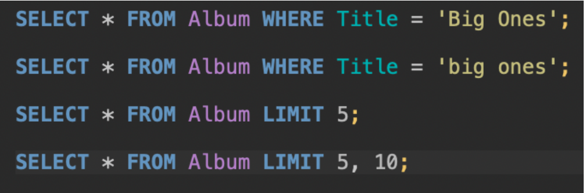

(\#fig:unnamed-chunk-1)Downloading R from the CRAN

Connect to a local instance of a mysql server
We don’t want to use SQLite, we want mySQL!
Click new database connection (Blue Arrow)

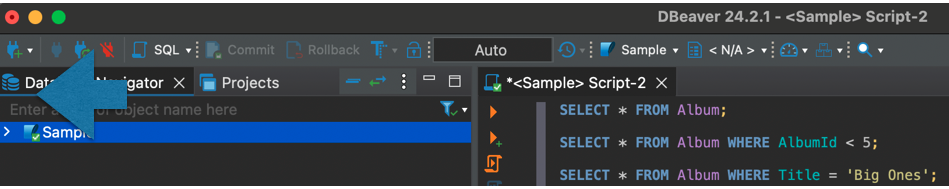

(\#fig:unnamed-chunk-2)Downloading R from the CRAN

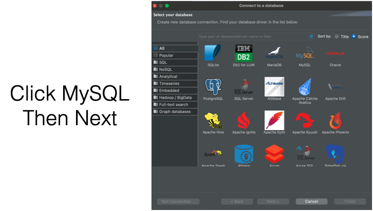

(\#fig:unnamed-chunk-3)Downloading R from the CRAN

Connect to a local instance of a mysql server
Enter your password for mysql (that you wrote down earlier) 
Click ‘Test Connection’

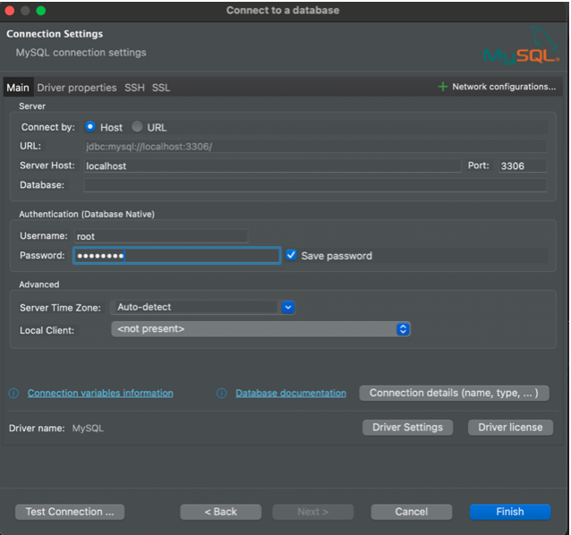

(\#fig:unnamed-chunk-4)Downloading R from the CRAN

Connect to a local instance of a mysql server
Enter your password for mysql and click ‘Test Connection’

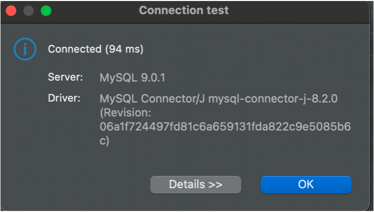

(\#fig:unnamed-chunk-5)Downloading R from the CRAN

Everything is looking good here
But what if you have errors?

### Troubleshooting Common Errors

Enter your password for mysql and click ‘Test Connection’
We have an error! 
What do you think went wrong? How would you troubleshoot this problem?

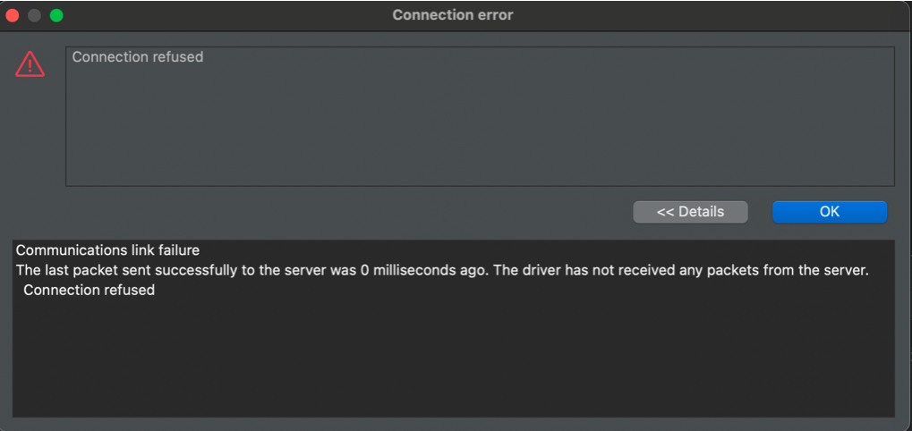

(\#fig:unnamed-chunk-6)Downloading R from the CRAN

Enter your password for mysql and click ‘Test Connection’
We didn’t have our server on! So we couldn’t connect. 
The hint was that it only ran for 0 milliseconds (instantly failed)
If this happened to you, click ‘Start MySQL Server’

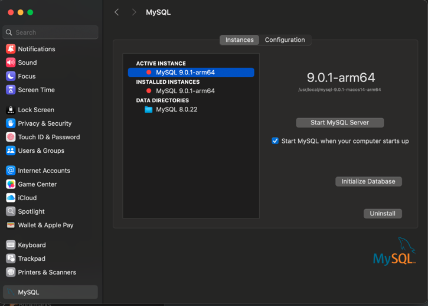

(\#fig:unnamed-chunk-7)Downloading R from the CRAN

Enter your password for mysql and click ‘Test Connection’
We have an error! 
What do you think went wrong? How would you troubleshoot this problem?

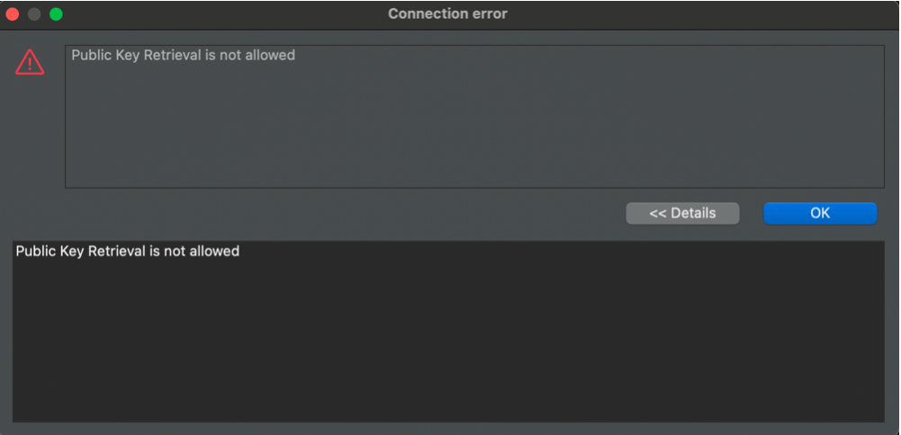

(\#fig:unnamed-chunk-8)Downloading R from the CRAN

Enter your password for mysql and click ‘Test Connection’
I had to look for the answer to this - but you could too. Go to google and type in ‘dbeaver public key retrieval is not allowed’ and find the post with the solution:  
https://stackoverflow.com/questions/50379839/connection-java-mysql-public-key-retrieval-is-not-allowed

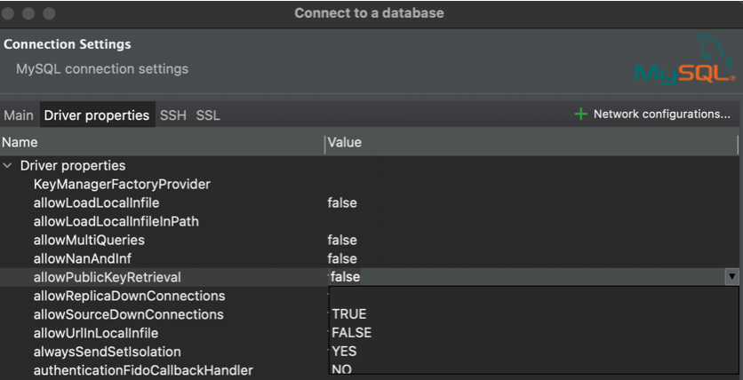

(\#fig:unnamed-chunk-9)Downloading R from the CRAN

Enter your password for mysql and click ‘Test Connection’
Click on the ‘Driver properties’ tab
Change allowPublicKeyRetrieval to TRUE
This means a hacker could steal your password (if this was a server that anyone else could access) so ask your IT department before doing this on the job

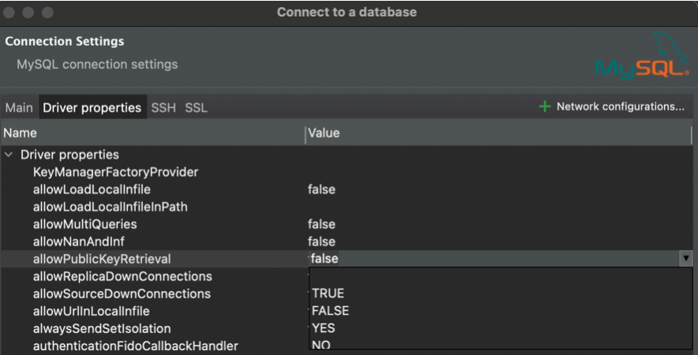

(\#fig:unnamed-chunk-10)Downloading R from the CRAN

Load in a SQL script

We can use a SQL Script to create a database

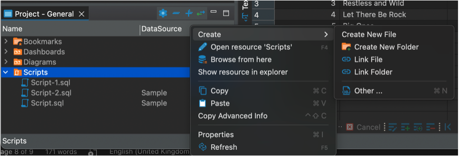

(\#fig:unnamed-chunk-11)Downloading R from the CRAN

Download some SQL sample data from https://www.mysqltutorial.org/wp-content/uploads/2018/03/mysqlsampledatabase.zip
Unzip the file and store it in a relevant location.
 In DBeaver, look in the lower left hand corner of your screen
Right Click Scripts and select ‘Link File’

(\#fig:unnamed-chunk-12)Downloading R from the CRAN

Right Click the script and select ‘Associate with data source’

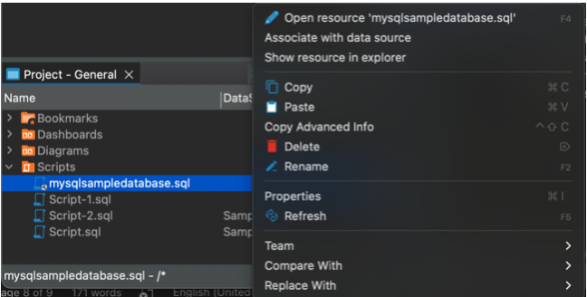

(\#fig:unnamed-chunk-13)Downloading R from the CRAN

Select localhost

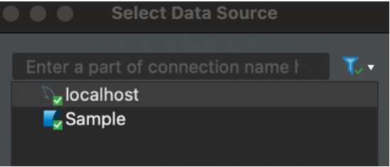

(\#fig:unnamed-chunk-14)Downloading R from the CRAN

 Double click the script name
 Check what Databases you have available in your localhost server
 Run your imported sql script all at once (the orange triangle with a green cross)
 Check what Databases you have available in your localhost server
 Has anything changed? If it hasn’t, right click localhost and select refresh
Congratulations, you have just made your first database

(\#fig:unnamed-chunk-15)Downloading R from the CRAN

Running Queries

 Create a new script and make sure it is associated with local host
 Save the script with an informative name
 Write the code below and run it line by line
 What do you think is happening here?
 Why didn’t why need the database name with a ‘.’ when we did this command with the first data base we used?
 

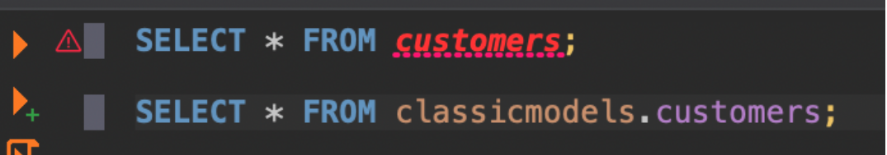

(\#fig:unnamed-chunk-16)Downloading R from the CRAN

 

 Write the code below into your script and run it line by line
 What do the results look like?
 Did the code behave the same as when we used SQLite? What are the differences?
 We installed mySQL outside of DBeaver and SQLite within it. Why do you think that is?
 

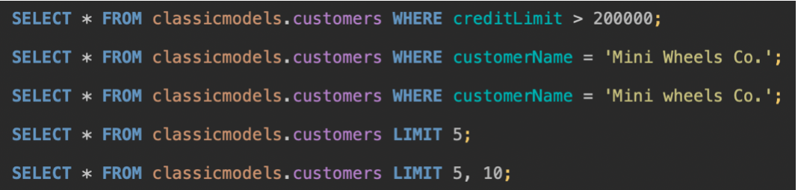

(\#fig:unnamed-chunk-17)Downloading R from the CRAN

