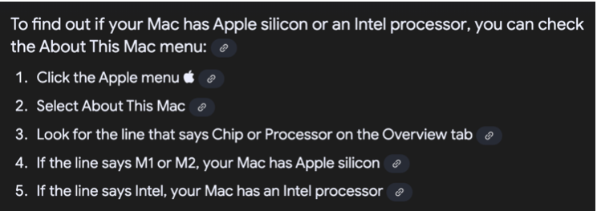
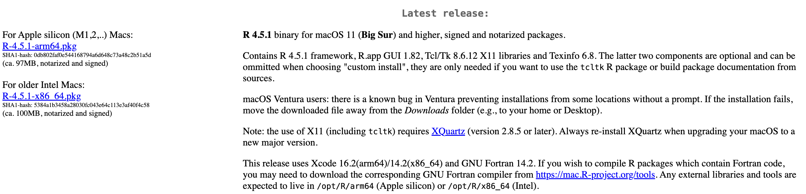
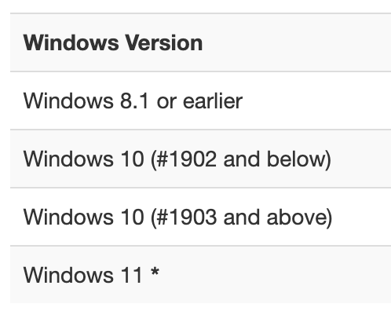
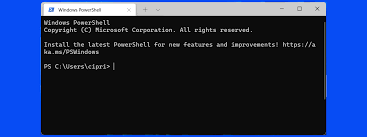
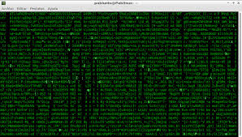

# Getting to Know Your Computer

There are two main sources of confusion to those relatively new to programming: understanding how to install open-source software and how to use the Terminal. While there are download instructions in this guide, you will need to understand your Computer Specifications so you can make the right selection for your machine. Additionally, understanding what the Terminal is and what it is doing offers a nice introduction to computer programming and can help make the interface feel more user friendly.

## Computer Specifications {#Computer-Specifications}

When installing a program on your computer, you are often presented with several versions of the software depending on your computer specifications.

### Mac Computer Specifications

To determine the specifications of your Mac and find compatible software downloads, you should first identify your specific Mac model and then check the software's system requirements. You can find your Mac's specifications by going to About This Mac in the Apple menu. Then, compare these specifications with the requirements of the software you intend to download. The main thing to establish is whether you have a silicon or Intel processor.

(\#fig:unnamed-chunk-1)Determining Silicon or Intel Processor

Here is an example from the R Studio download page for Mac. Note that there are two versions - silicon and Intel - that you have to choose from.

(\#fig:unnamed-chunk-2)Example of Download Differences

### Windows Computer Specifications

Most current software downloads are for Windows 10 or 11.

To check your Windows version, you can use either the Settings app or the "winver" command. In Settings, navigate to System > About. Alternatively, press the Windows key + R, type "winver", and press Enter. The "About" section in Settings and the winver window will both display your Windows edition, version, and build number.

Important Edition and Versions:

(\#fig:unnamed-chunk-3)Important Windows Edition and Versions

Windows 10 (1903 and above) will be able to install everything that Windows 11 can, but earlier versions (1902 and below) or earlier editions (8.1 or earlier) cannot install the current version of most softwares. You will need to go into the archive of software downloads to find the version that works with your Windows edition. If you are having trouble with this, please let us know with the help form.

Software downloads will often come in three options which correspond to the different Windows system architectures: 32-bit, 64-bit, or ARM. To find out if your Windows PC has a 32-bit (x86), 64-bit (x64), or ARM architecture, navigate to Settings > System > About. Under "Device specifications," the "System type" field will indicate whether your system is "x64-based processor," "ARM-based processor," or "x86-based processor".

### Linux Computer Specifications

Linux is a family of open-source operating systems (OS) based on the Linux kernel, created by Linus Torvalds. It's known for its versatility, security, and customization options, making it popular for everything from supercomputers to embedded systems. Essentially, it's a free, open-source alternative to operating systems like Windows and macOS.

Typically those who use Linux have advanced technical skills. HDA does not teach Linux or offer technical support for it. However, all of the programming languages and tools that we use are compatible with Linux. HDA asks that you utilize a Windows or Mac operating system if you have the option. Please get in contact with the program using the help form above if you have to use Linux and are unable to complete this computer set up section.

## The Black Box

Unix is a foundational operating system that provides the basic structure for running computer programs and managing hardware resources. You can access it with a Terminal. A Terminal is a text-based interface used to interact with a computer’s operating system. You might also hear it referred to as a CLI (Command Line Interface). Every Operating System — be it Windows, Linux or Mac has a terminal that users can use to interact with the OS.

The terminal is informally referred to as "The Black Box" given that it seems intimidating and overwhelming to those who haven't used it, but have seen someone else interact with it.

(\#fig:unnamed-chunk-4)The Blackbox of the Terminal

The Terminal is commonly what is shown during "hacking" scenes in movies like the Matrix given that it will instantly impress any non-technical audience.

(\#fig:unnamed-chunk-5)Common Depiction of Shell Scripting

### Demystifying the Terminal

This Terminal is a software — essentially a translator that gives you access to a computer’s shell. Examples include the Command Prompt on Windows, and the Terminal on MacOS and Linux. When you open up a Terminal, you are able to type in text. Certain keywords will perform tasks on your computer.

The Shell is where the magic happens. After typing your command into the terminal, the shell interpretes that command, and executes it accordingly.

There are different types of shell, each with it’s own unique features. The Bourne-Again Shell known as Bash, is popular amongst Linux System Administrators. Bash is a shell used to manage files, run scripts for automation, and generally control your system.

HDA teaches Bash, but there is also Zsh (Mac), Fish, and PowerShell (Windows). The basic syntax is the same but each has different advanced capabilities for different tasks. For example, PowerShell is used for complex scripting, managing and automating Windows systems, managing virtual machines, and working with .NET Libraries. Bash offers a lightweight and relatively user-friendly interface that can accomplish every task you need in HDA while establishing a familiarity with the core features of shell scripting.

In the next section of the pre-course guide, you will use the Terminal to perform a few simple tasks to increase your comfort with the interface.
