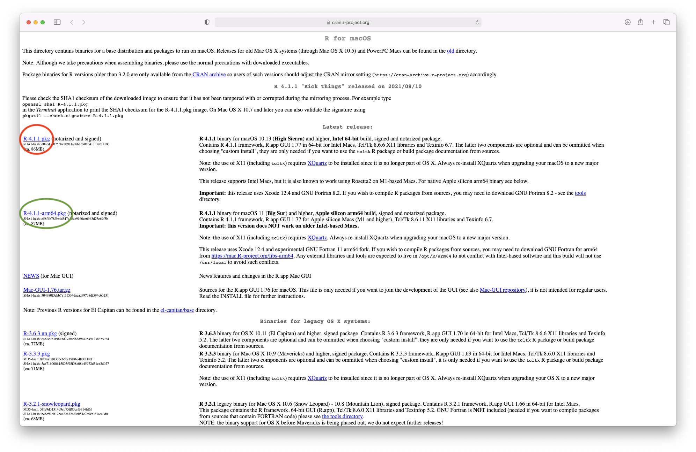
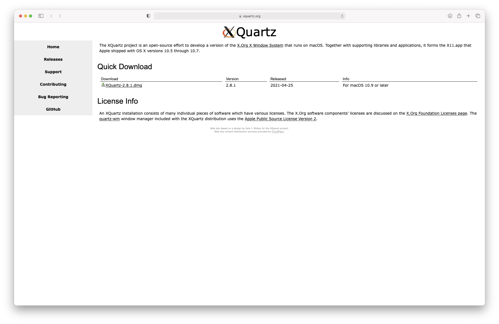
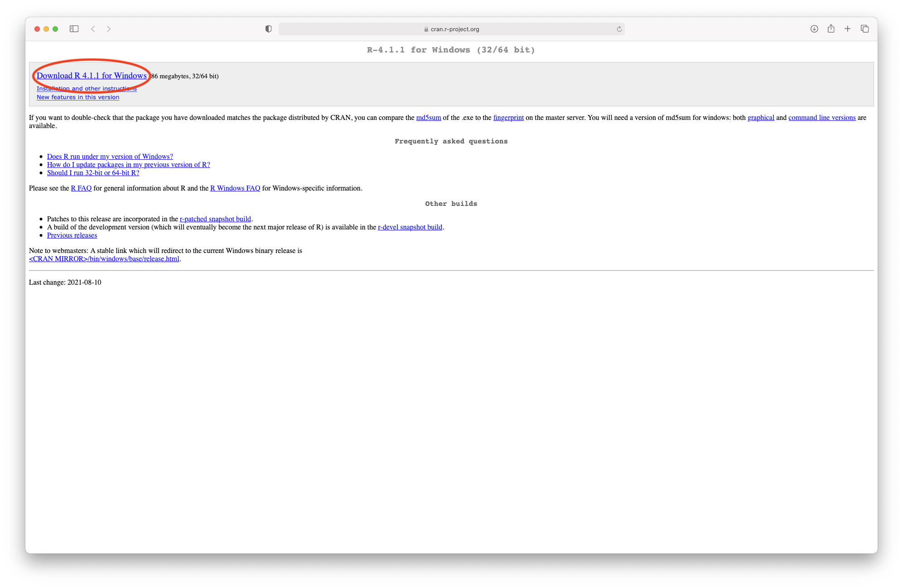
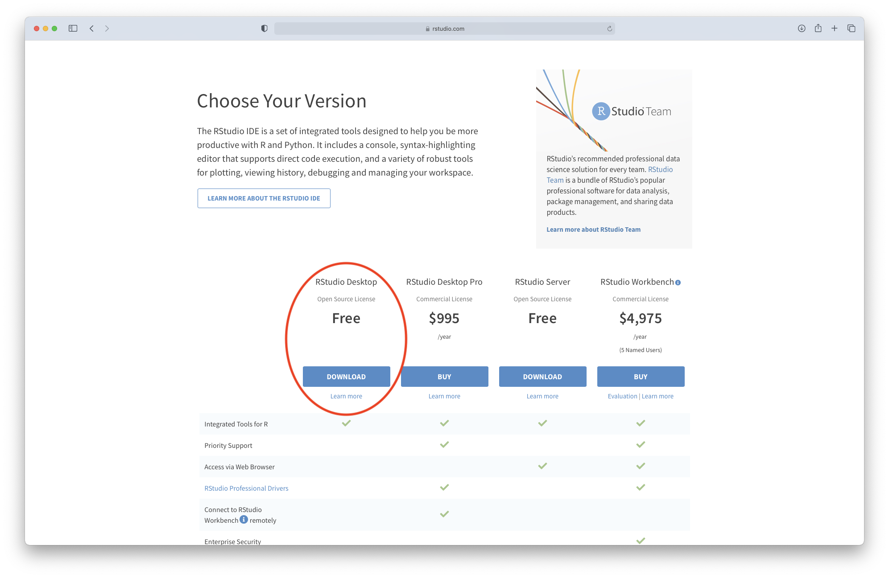
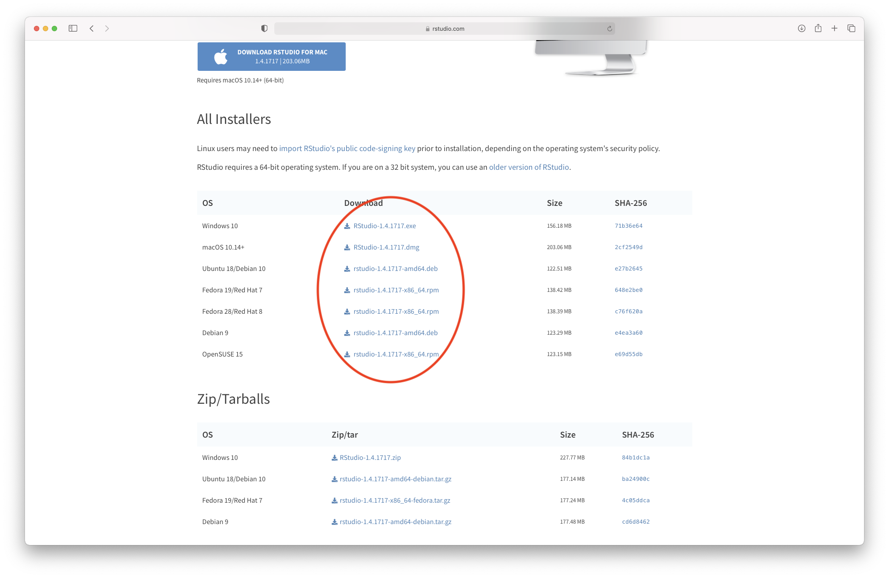
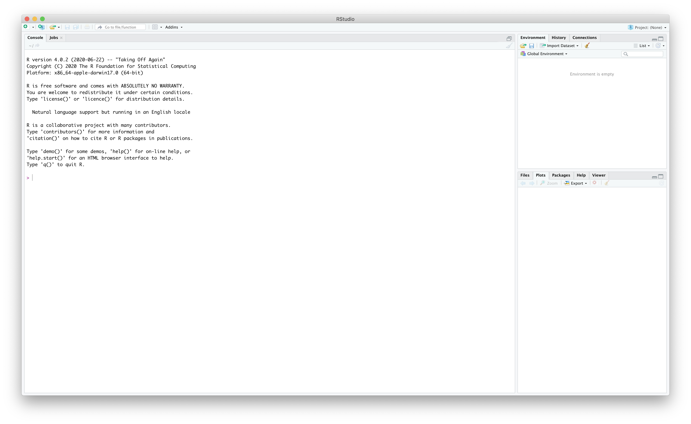
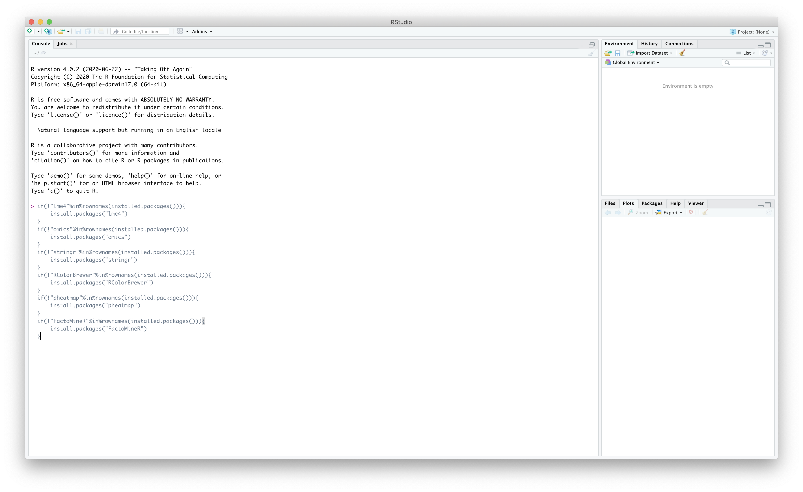

# Software installation

\texttt{R} is a programming language widely used for statistical analyses (see https://www.r-project.org/about.html). The CRAN (Comprehensive R Archive Network) is a free repository of packages containing built-in functions that can be used for data analysis, visualisation, simulations, etc. During this tutorial, we are going to use functions from six R packages that will have to be installed and loaded. 

## R installation

### Mac users

R for Mac OS X can be downloaded from the following link: https://cran.r-project.org/bin/macosx/

&nbsp;

The link will take you to the download page on the CRAN (Figure 1). Please select the latest version by clicking on R-4.1.1.pkg (circled in red) if this version can be supported on your machine. Otherwise, choose the latest supported version. If you have a laptop with the Apple chip, you can select the version circled in green, which has been specifically designed for that chip.

(\#fig:unnamed-chunk-1)Downloading R from the CRAN

Once the download has finished, you can follow the recommended steps for installation (Figure 2). 

(\#fig:unnamed-chunk-2)R installation

As indicated on the download page, you will also need to install XQuartz to be able to use some more advanced R functionalities. This can be done from this link: https://www.xquartz.org

(\#fig:unnamed-chunk-3)Downloading XQuartz

### Windows users 

R for Windows can be downloaded from the following link: https://cran.r-project.org/bin/windows/base/

&nbsp;

The link will take you to the download page on the CRAN (Figure 4). Please select the latest version by clicking on "Download R 4.1.1 for Windows".

(\#fig:unnamed-chunk-4)Downloading R from the CRAN

\clearpage

## R Studio installation

R Studio can be downloaded from https://www.rstudio.com/products/rstudio/download/

&nbsp;

This link will take you to the webpage displayed in Figure 5. You will need to click on "Download", which will take you to the page showed in Figure 6. From there, you can select the installation file corresponding to your system. Once the file is downloaded, please follow the instructions for installation.

(\#fig:unnamed-chunk-5)Downloading R Studio (step 1)

(\#fig:unnamed-chunk-6)Downloading R Studio (step 2)

\clearpage

## Package installation

Once both R and R Studio are installed, you can open R Studio (Figure 7).

(\#fig:unnamed-chunk-7)Downloading R Studio (step 2)

(\#fig:unnamed-chunk-8)Downloading R Studio (step 2)

You will then need to press the return key to submit these commands. This will start the installation of the required packages. Some lines should automatically appear on the console, they indicate the different steps of the package installation. When no more lines are printed and the last line in your console starts with a ">", the installation is finished. You can close the application. 

You need these packages on your local machine to run the code chunks of the clustering workshop.

